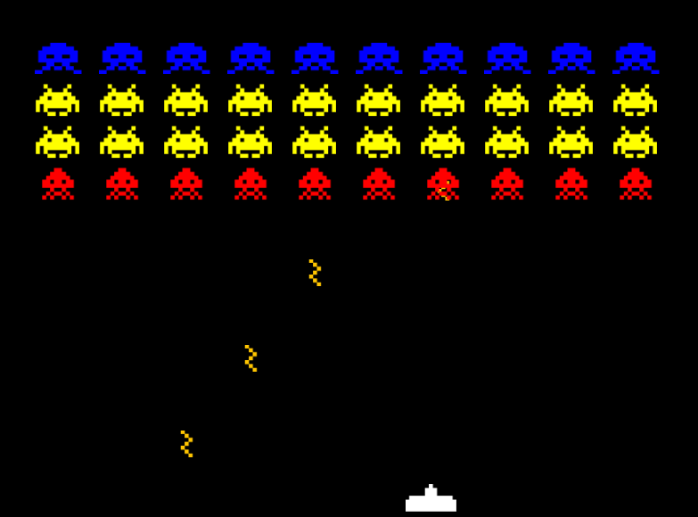

# rustvaders

Rust invaders recall :)



## Quick Start

```
./install.sh # first time only
./run.sh
```

* `install.sh` - install libraries for compilation and runtime (current target)
* `install-wingnu-crosstools.sh` - sets you up for windows target build (assuming `x86_64-linux-gnu` as current target)
* `install-macos-crosstools.sh` - sets you up for mac os development, don't forget to add `export PATH="$PATH:$HOME/opt/osxcross/target/bin"` into `.bashrc`
* `build.sh` - builds `linux` and `windows` release binaries 
* `run.sh` - wrapper over `cargo run` - executes the package
